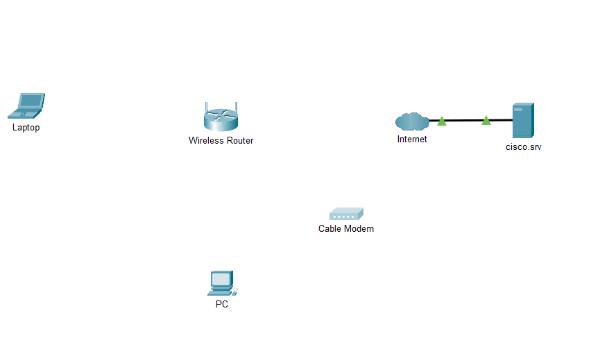
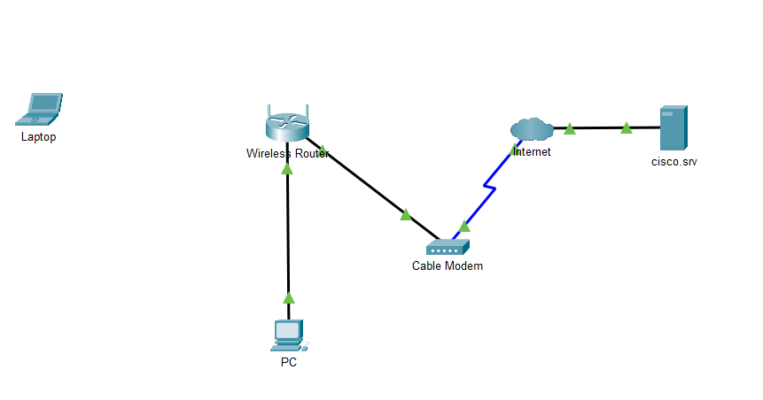
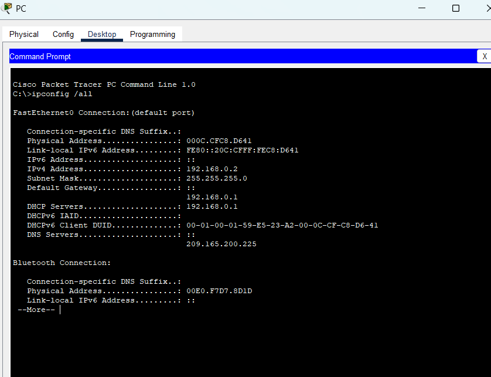
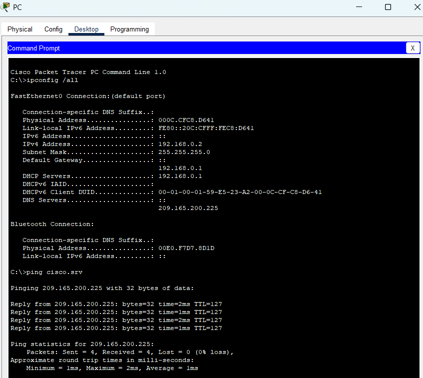
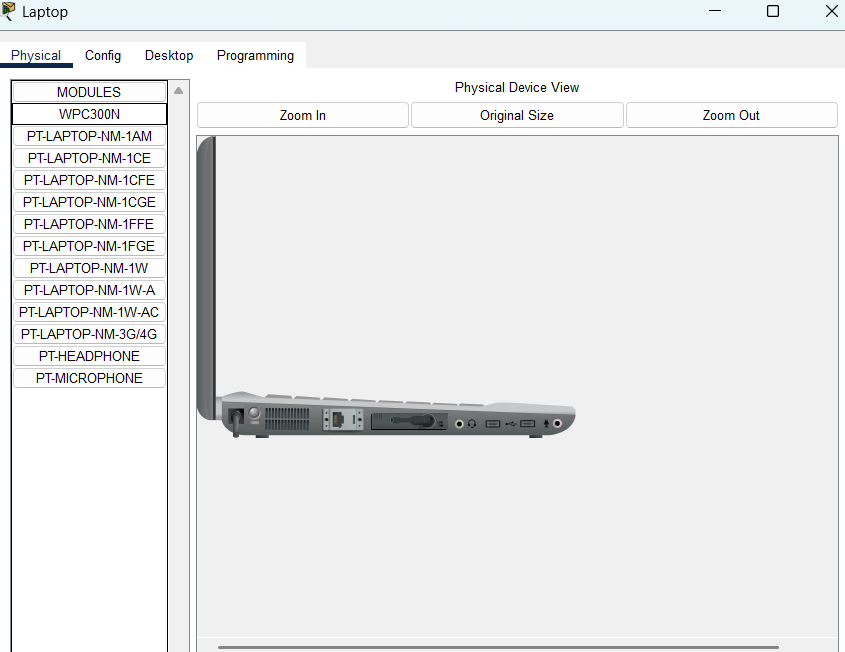
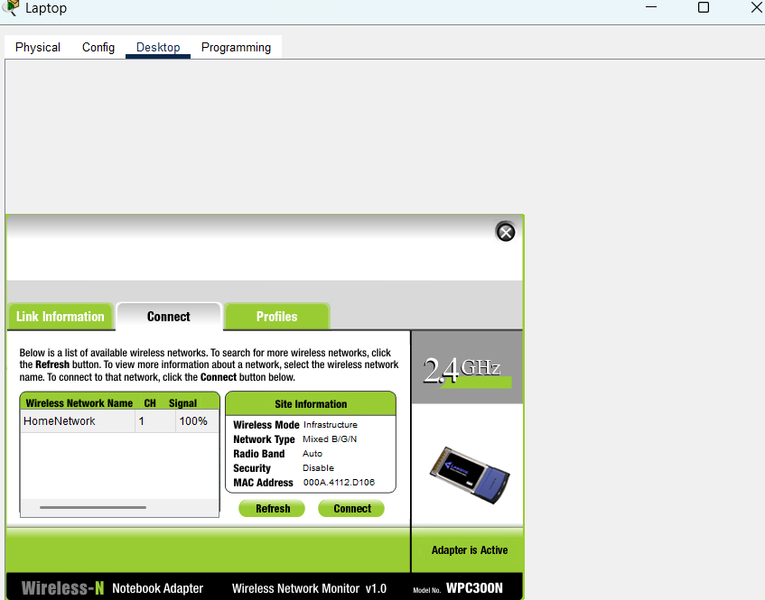
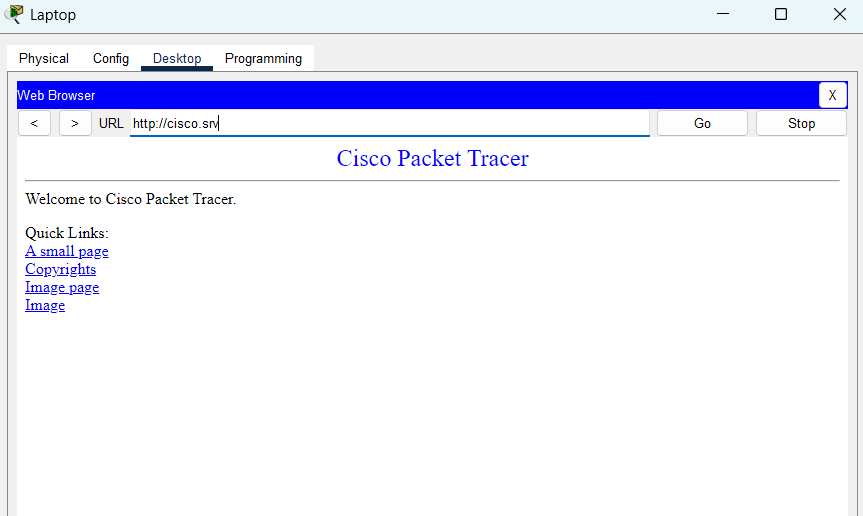
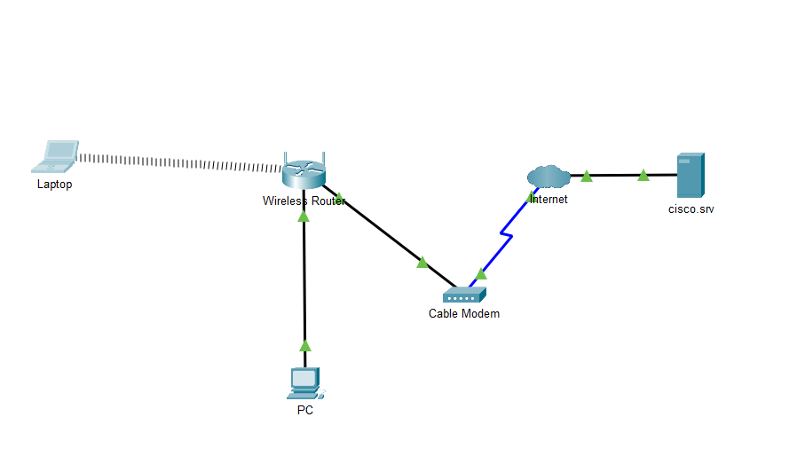

# Small-office-network
This project demonstrates how to build and configure a basic home network in Cisco Packet Tracer.
## Objectives
1. Build a simple network in packet Tracer's Logical Workspace.
2. Configure end devices with IP addresses using DHCP.
3. Verify device connectivity through 'ipconfig' and 'ping'.
4. Connect a laptop to the wireless router using a wireless NIC.

## Part 1: Build the Simple Network

## Step 1: Add and Rename Devices
- PC - End Devices > End Devices > PC
- Laptop - End Devices > End Devices > Laptop
- Cable Modem > Network Devices > WAN Emulation > Cable Modem
- Cloud > Network Devices > WAN Emulation > Cloud

 
## Step 2: Add Cabling
- PC > Wireless Router: Copper straight-through (PC FastEthernet0 - Router Ethernet 1)
- Wireless Router > Cable Modem: Copper straight-through (Router Internet - Modem Port 1)
- Cable Modem > Cloud: Coxial (Modem Port 0 - Cloud Coaxial 7)

## Part 2: Configure End Devices and Verify Connectivity

## Step 1: Configure the PC 
- Open 'Desktop' > 'IP Configuration'.
- Enable **DHCP** to recieve IPv4 address.
- Open 'Desktop' > 'Command Prompt'
- Type 'ipconfig /all' - Confirm IPv4 address assigned to PC.

- Test connectivity to the cisco server from the PC.
- 'Command Prompt' > 'ping cisco.srv' > Ping Successful

## Step 2: Configure the Laptop.
- Click 'Laptop' and select the 'Physical' tab.
- In the 'Physical' tab turn laptop off and remove the 'ethernet copper module' and replace it with the 'wireless WPC300N module'

- Power the laptop on
- Connect Laptop to wireless home network 'Desktop' > 'PC Wireless' > 'Connect'

- Check connection to internet select 'Web Browsers' Type 'cisco.rv

## Results
- Both PC and Laptop successfully received IP addresses via DHCP and connected to the internet through the wireless router and cable modem.

# Reflection
- This project reinforced key networking concepts:
- Understanding device roles (PC, laptop, wireless router, modem, cloud).
- Using DHCP for dynamic IP addressing.
- Using ipconfig and ping for troubleshooting.
- Switching from wired to wireless NICs.
- This project demonstrates how home/office networks route traffic from internal devices to the internet via the default gateway and ISP modem.

